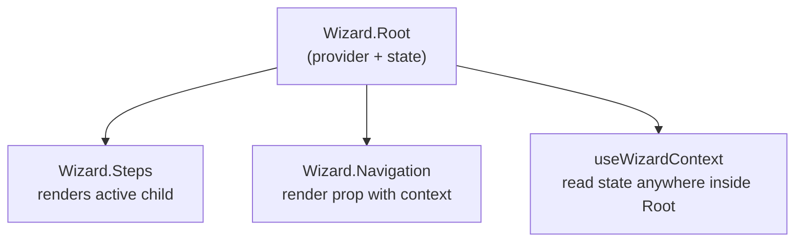

# use-step-wizard

[](https://www.npmjs.com/package/use-step-wizard)
[](https://github.com/ppromerojr/use-step-wizard/blob/main/LICENSE)
[](https://www.typescriptlang.org/)
[](https://react.dev/)

**Headless multi-step wizard state for React — web and React Native.**

## 🚀 Why `use-step-wizard`?

Building multi-step forms, onboarding flows, or checkout funnels shouldn't force you into restrictive UI kits. 

* **🧱 True Headless Design** – No forced styles, wrappers, or DOM assumptions. Complete architectural freedom.
* **🧩 Compound Components** – Explicit, declarative structures like `Wizard.Root`, `Wizard.Steps`, and `Wizard.Navigation`.
* **📱 Universal Compatibility** – Write once, use anywhere. Full native support for React Native without changing the API.
* **💪 TypeScript-First** – Deeply typed autocompletion out of the box.
* **🪶 Ultra-Lightweight** – Zero external dependencies, built natively on React 18+ principles.

## Contents

- [Install](#install)
- [Quick start](#quick-start)
- [How it works](#how-it-works)
- [React web](#react-web)
- [React Native](#react-native)
- [Hooks](#hooks)
- [Step metadata](#step-metadata)
- [API](#api)
- [Examples](#examples)
- [Development](#development)
- [License](#license)

## Install

```bash
npm install use-step-wizard
```

Peer dependency: **React 18+**

## Quick start

```tsx
import { Wizard } from "use-step-wizard";

export default function App() {
  return (
    <Wizard.Root initialStep={0} name="onboarding">
      <Wizard.Steps>
        <div key="profile" name="profile">Profile</div>
        <div key="details" name="details">Details</div>
        <div key="review" name="review">Review</div>
      </Wizard.Steps>

      <Wizard.Navigation>
        {({ previous, next, isFirstStep, isLastStep, activeIndex, totalSteps }) => (
          <div>
            <button type="button" onClick={previous} disabled={isFirstStep}>
              Back
            </button>
            <span>
              Step {activeIndex + 1} of {totalSteps}
            </span>
            <button type="button" onClick={next} disabled={isLastStep}>
              {isLastStep ? "Done" : "Next"}
            </button>
          </div>
        )}
      </Wizard.Navigation>
    </Wizard.Root>
  );
}
```

Named or default import — both work:

```tsx
import { Wizard, type WizardContextType } from "use-step-wizard";
// or
import Wizard, { type WizardContextType } from "use-step-wizard";
```

## How it works



1. **`Wizard.Root`** creates wizard state and provides context.
2. **`Wizard.Steps`** renders only the active step from its children.
3. **`Wizard.Navigation`** gives you `previous`, `next`, `goToStep`, and more via a render prop.

## React web

Full example with reusable step cards:

```tsx
import { Wizard, type WizardContextType } from "use-step-wizard";

function StepCard({
  title,
  description,
}: {
  name?: string;
  title: string;
  description: string;
}) {
  return (
    <div>
      <h2>{title}</h2>
      <p>{description}</p>
    </div>
  );
}

function Navigation() {
  return (
    <Wizard.Navigation>
      {({
        previous,
        next,
        isFirstStep,
        isLastStep,
        activeIndex,
        totalSteps,
      }: WizardContextType) => (
        <div>
          <button type="button" onClick={previous} disabled={isFirstStep}>
            Back
          </button>
          <span>
            Step {activeIndex + 1} of {totalSteps}
          </span>
          <button type="button" onClick={next} disabled={isLastStep}>
            {isLastStep ? "Done" : "Next"}
          </button>
        </div>
      )}
    </Wizard.Navigation>
  );
}

export default function App() {
  return (
    <Wizard.Root initialStep={0} name="onboarding">
      <Wizard.Steps>
        <StepCard
          key="profile"
          name="profile"
          title="Profile"
          description="Collect basic user information."
        />
        <StepCard
          key="details"
          name="details"
          title="Details"
          description="Add preferences and settings."
        />
        <StepCard
          key="review"
          name="review"
          title="Review"
          description="Confirm everything before finishing."
        />
      </Wizard.Steps>
      <Navigation />
    </Wizard.Root>
  );
}
```

## React Native

Same API — swap primitives for `View`, `Text`, and `Pressable`.

<details>
<summary>View React Native example</summary>

```tsx
import { Pressable, Text, View } from "react-native";
import { Wizard, type WizardContextType } from "use-step-wizard";

function StepCard({
  title,
  description,
}: {
  name?: string;
  title: string;
  description: string;
}) {
  return (
    <View>
      <Text>{title}</Text>
      <Text>{description}</Text>
    </View>
  );
}

function Navigation() {
  return (
    <Wizard.Navigation>
      {({
        previous,
        next,
        isFirstStep,
        isLastStep,
        activeIndex,
        totalSteps,
      }: WizardContextType) => (
        <View style={{ flexDirection: "row", alignItems: "center", gap: 12 }}>
          <Pressable onPress={previous} disabled={isFirstStep}>
            <Text>Back</Text>
          </Pressable>
          <Text>
            Step {activeIndex + 1} of {totalSteps}
          </Text>
          <Pressable onPress={next} disabled={isLastStep}>
            <Text>{isLastStep ? "Done" : "Next"}</Text>
          </Pressable>
        </View>
      )}
    </Wizard.Navigation>
  );
}

export default function App() {
  return (
    <Wizard.Root initialStep={0} name="onboarding">
      <Wizard.Steps>
        <StepCard
          key="profile"
          name="profile"
          title="Profile"
          description="Collect basic user information."
        />
        <StepCard
          key="details"
          name="details"
          title="Details"
          description="Add preferences and settings."
        />
        <StepCard
          key="review"
          name="review"
          title="Review"
          description="Confirm everything before finishing."
        />
      </Wizard.Steps>
      <Navigation />
    </Wizard.Root>
  );
}
```

</details>

Runnable demo: [`examples/react-native/App.tsx`](./examples/react-native/App.tsx)

## Hooks

### `useWizardContext`

Read wizard state anywhere inside `<Wizard.Root>`:

```tsx
import { useWizardContext } from "use-step-wizard";

function StepIndicator() {
  const { activeIndex, totalSteps } = useWizardContext();
  return (
    <span>
      {activeIndex + 1} / {totalSteps}
    </span>
  );
}
```

### `useWizardState`

Standalone state when you don't need the provider components:

```tsx
import { useWizardState } from "use-step-wizard";

const wizard = useWizardState({ initialStep: 0, name: "checkout" });
```

## Step metadata

Pass `name` on step children to register metadata:

```tsx
<Wizard.Steps>
  <ProfileStep name="profile" />
  <DetailsStep name="details" />
  <ReviewStep name="review" />
</Wizard.Steps>
```

```tsx
const { steps, goToStep } = useWizardContext();
// steps: [{ index: 0, name: "profile" }, ...]
```

## API

### Components

| Export | Props | Description |
| --- | --- | --- |
| `Wizard.Root` | `children`, `initialStep?`, `name?` | Provider that holds wizard state |
| `Wizard.Steps` | `children` | Renders the active step from its children |
| `Wizard.Navigation` | `children` | Render prop or static children with wizard context |

### Hooks

| Export | Description |
| --- | --- |
| `useWizardContext` | Read wizard state inside `Wizard.Root` |
| `useWizardState` | Standalone wizard state hook |

### Types

| Export | Description |
| --- | --- |
| `WizardContextType` | Shape of wizard context values |
| `WizardContext` | Low-level React context |

<details>
<summary>WizardContextType reference</summary>

| Property | Type | Description |
| --- | --- | --- |
| `name` | `string` | Wizard display name |
| `steps` | `WizardStep[]` | Registered step metadata |
| `activeIndex` | `number` | Current step index (clamped) |
| `totalSteps` | `number` | Total number of steps |
| `isFirstStep` | `boolean` | Whether on the first step |
| `isLastStep` | `boolean` | Whether on the last step |
| `previous` | `() => void` | Go to previous step |
| `next` | `() => void` | Go to next step |
| `goToStep` | `(index: number) => void` | Jump to a step by index |
| `setTotalSteps` | `(total: number) => void` | Manually update step count |
| `setState` | `Dispatch<SetStateAction<WizardState>>` | Update full wizard state |

</details>

## Examples

| Platform | Path |
| --- | --- |
| React web | [`examples/react-web`](./examples/react-web) |
| React Native | [`examples/react-native`](./examples/react-native) |

```bash
# from repo root
cd examples/react-web && npm install && npm run dev
cd examples/react-native && npm install && npm start
```

## Development

```bash
npm install
npm run build
npm run typecheck
npm test
```

## License

MIT © [Pabs Romero Jr.](https://github.com/ppromerojr)
